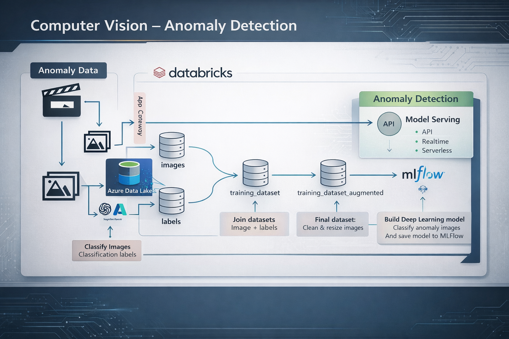
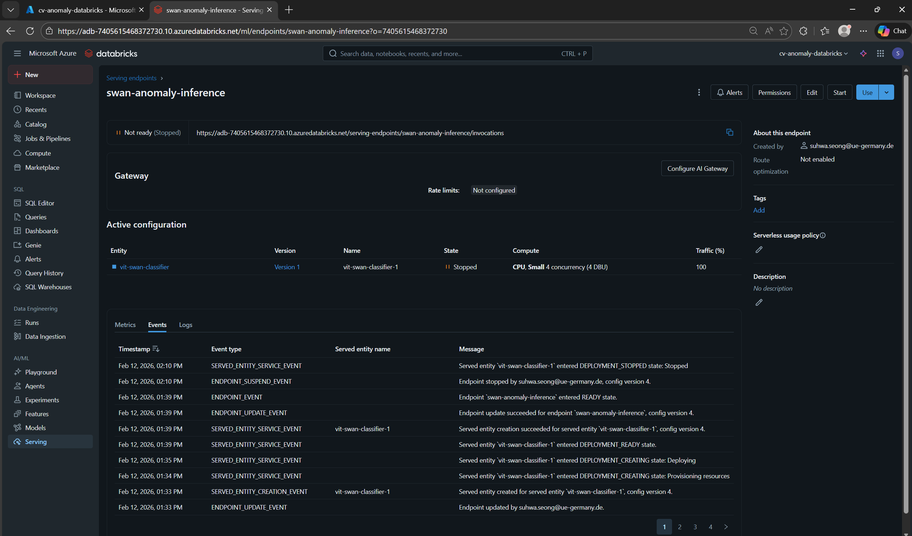
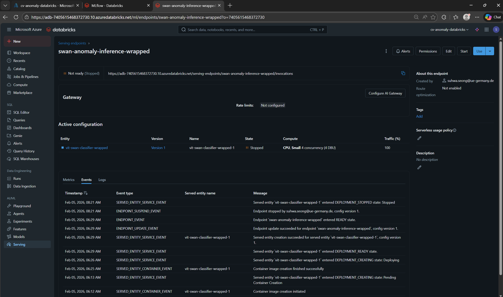
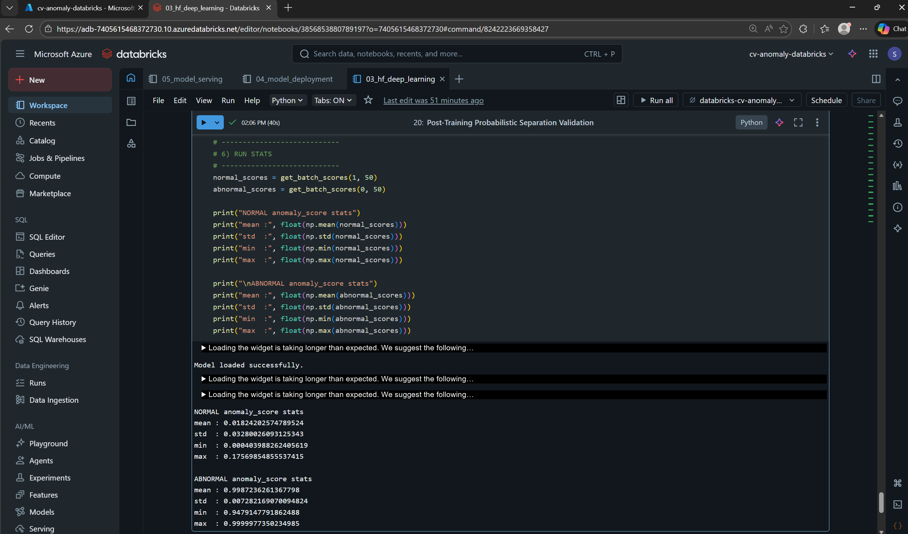

# 🦢 Cloud-Deployed ViT for Image Anomaly Scoring on Azure Databricks


End-to-end cloud-native computer vision pipeline for probabilistic anomaly scoring using Vision Transformer (ViT), built and deployed on Azure Databricks with MLflow lifecycle management.

This project demonstrates production-oriented ML engineering:

* Local synthetic dataset design
* Distributed Spark-based image ETL
* Delta-backed dataset lineage
* Transfer learning with HuggingFace + PyTorch
* MLflow experiment tracking
* Model registry versioning
* Managed model serving
* REST-based inference validation
* Post-training probabilistic separation verification

---

# Executive Summary

The dataset was derived from a single 18-second swan video. Frames were extracted locally and augmented with synthetic structural anomalies to construct a controlled anomaly detection setup. The dataset was intentionally kept small to validate the full ML pipeline from data generation to deployment rather than to benchmark large-scale anomaly detection performance.

The entire pipeline was engineered and validated inside Azure Databricks:

* Distributed preprocessing using Spark
* Version-controlled dataset storage via Delta tables
* MLflow lifecycle tracking
* Model registry publishing
* Managed serving endpoint deployment
* Softmax-based anomaly scoring validation

Final validation demonstrated clear probabilistic separation between normal and abnormal samples within the evaluated batches, confirming consistent system behavior beyond standard accuracy metrics.

---

# 📌 Problem Definition

Binary image classification used for anomaly scoring.

| Class | Meaning                      |
| ----- | ---------------------------- |
| 0     | Abnormal (synthetic anomaly) |
| 1     | Normal (swan frame)          |

Anomaly score definition:

```
anomaly_score = P(class = 0 | image)
```

Derived from:

```
softmax(logits)
```

The system outputs calibrated probabilities instead of hard labels, enabling threshold-based production deployment.

---

# 🏗 System Architecture



End-to-End Flow

Local video
→ Frame extraction
→ Synthetic anomaly generation
→ Upload to Azure Data Lake
→ Spark ETL + distributed augmentation
→ ViT fine-tuning
→ MLflow tracking and registry
→ Databricks Model Serving
→ REST inference
→ Softmax
→ anomaly_score = P(abnormal | image)

The architecture separates concerns across:

1. Data Engineering Layer
2. Model Training Layer
3. MLOps Governance Layer
4. Production Inference Layer

---

# 🧰 Tech Stack

| Category        | Tools                              |
| --------------- | ---------------------------------- |
| Language        | Python                             |
| Model           | google/vit-base-patch16-224        |
| Framework       | PyTorch + HuggingFace              |
| Data Processing | Apache Spark + pandas UDF          |
| Tracking        | MLflow                             |
| Cloud           | Azure Data Lake + Azure Databricks |
| Deployment      | Databricks Model Serving           |

---

# 📂 Repository Structure

```
cv-anomaly-detection-vit/
├── databricks_pipeline/
├── local_preprocessing/
├── assets/
└── README.md
```

---

# 🔹 Dataset Engineering

Synthetic anomaly strategy:

* Irregular polygon noise patches
* High-contrast salt and pepper artifacts
* Multi-region structural disturbance
* Controlled anomaly ratio (800 normal : 200 abnormal)

Frame extraction and structured anomaly synthesis were executed locally using custom Python scripts (frames.py, salt_pepper_noise.py, label.py, llm.py). The generated dataset was then uploaded to Azure Data Lake and ingested into the cloud-based processing pipeline for distributed ETL and training.

### Design Intent

Anomalies were deliberately made visually distinguishable.

Purpose:

* Validate model learning under controlled conditions
* Ensure clear probabilistic separation
* Stress-test deployment inference behavior
* Confirm training-serving consistency

This project focuses on system validation rather than subtle anomaly benchmarking.

---

# 🔹 Distributed Image Processing (Spark)

Implemented:

* Image listing + label join
* Center-biased cropping
* Resize to 224×224
* JPEG binary serialization
* Distributed augmentation with pandas UDF
* Delta table persistence

Benefits:

* Reproducibility
* Scalability
* Cloud-native consistency
* Dataset lineage tracking

---

# 🔹 Model Training (ViT + MLflow)

Model:

```
google/vit-base-patch16-224
```

Training setup:

* Transfer learning
* Custom classifier head
* Early stopping
* F1-based evaluation
* MLflow metric logging
* Model artifact logging
* Model signature inference
* MLflow Model Registry versioning

---

# 📊 Training Evidence

### MLflow Experiments


### MLflow Artifacts


### Training Metrics


Observed:

* Stable convergence
* Clear class signal
* Consistent validation performance

---

# 🔹 Model Registry


Demonstrates:

* Version-controlled deployment
* Artifact reproducibility
* Production readiness

---

# 🔹 Deployment (Databricks Model Serving)

Managed endpoint inside Azure Databricks:



Logits-only wrapper ensures schema stability:



REST Invocation Path:

```
/api/2.0/serving-endpoints/{endpoint-name}/invocations
```

---

# 🔹 Inference Logic

Endpoint returns:

```
{
  "predictions": [[logit_0, logit_1]]
}
```

Post-processing:

```
probs = softmax(logits)
anomaly_score = probs[0]
```

Example:

```
logits: [-2.17, 3.16]
probabilities: [0.0047, 0.9953]
anomaly_score: 0.0047
```

---

# 📊 Production Validation




Batch validation results:

Normal:

* mean anomaly_score ≈ 0.018
* max anomaly_score ≈ 0.176

Abnormal:

* mean anomaly_score ≈ 0.999
* min anomaly_score ≈ 0.948

No probability overlap was observed within the sampled validation batches.

Implications:

* Strong probabilistic separation
* Low false positive risk
* Low false negative risk
* Training-serving equivalence confirmed
* Softmax-based scoring stable in deployment

---

# 🔍 Key Design Decisions

### Probabilistic Scoring

Using softmax probabilities enables:

* Adjustable threshold policies
* Risk-sensitive deployment
* Drift monitoring compatibility

### Logits-Only Serving Wrapper

Ensures:

* Deterministic API schema
* Framework-agnostic output format
* Serving stability across environments

### Distributed Spark ETL

Prevents:

* Local preprocessing bottlenecks
* Non-reproducible data pipelines

Supports:

* Scalable production workflows

### Post-Training Probability Analysis

Beyond accuracy metrics, distribution-level validation was performed to verify system-level integrity.

---

# 🏭 Industrial Applicability

The probabilistic anomaly_score enables threshold tuning based on operational risk tolerance in real-world systems, supporting domain-specific calibration strategies.

This architecture directly applies to:

Manufacturing quality inspection
Infrastructure damage detection
Medical imaging triage
Security anomaly monitoring

---

# 🔐 Security

* No PAT tokens committed
* No SAS keys stored
* Environment-based secret management
* Databricks Secret Scope usage

---

# 🚀 Engineering Highlights

* Distributed Spark ETL
* Vectorized pandas UDF transformations
* Delta dataset lineage
* Transfer learning with ViT
* MLflow lifecycle governance
* Versioned model registry
* Managed Azure serving
* REST-based inference validation
* Probability-based anomaly scoring
* System-level validation analysis

---

# 👩‍💻 Author

Suhwa Seong
M.Sc. Data Science
University of Europe for Applied Sciences

Focus:

* Computer Vision
* ML Engineering
* MLOps
* Cloud-native ML Systems
* Production Deployment

---
