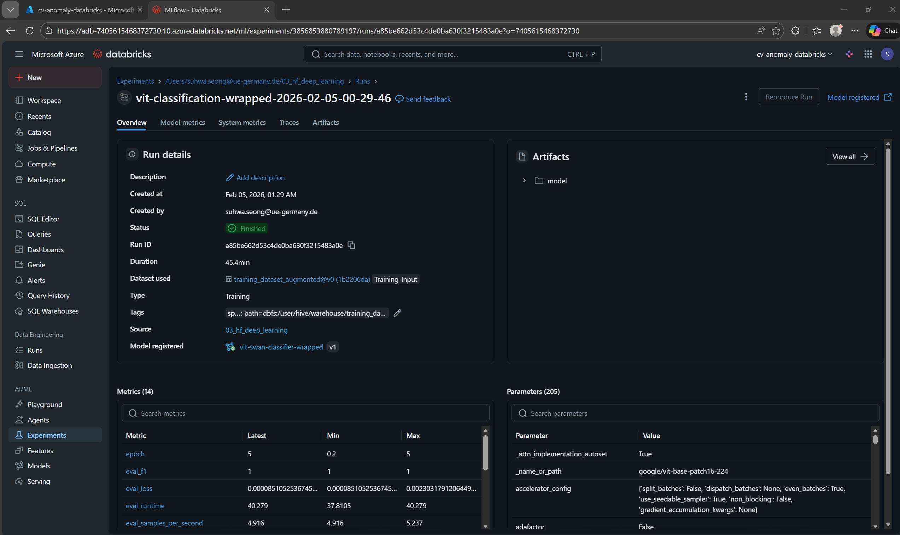
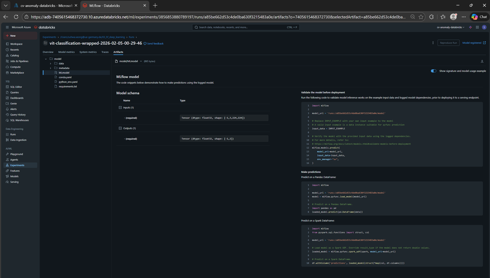
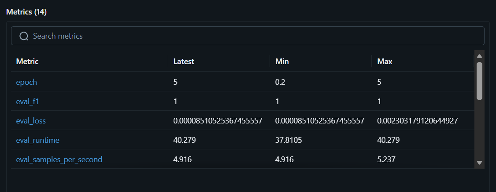
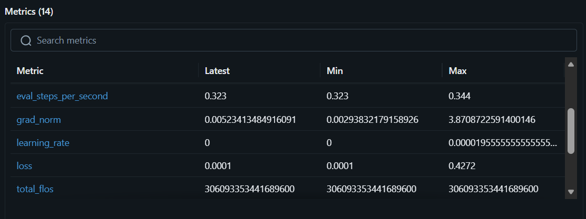
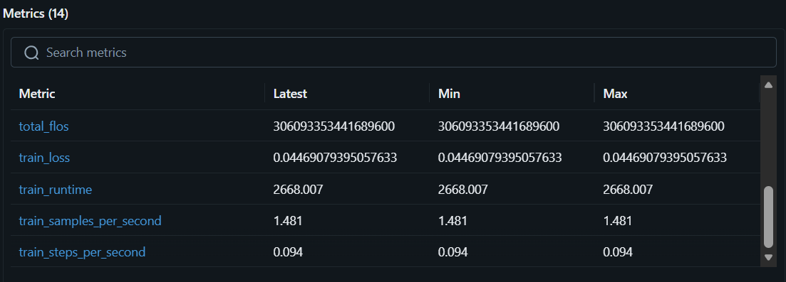
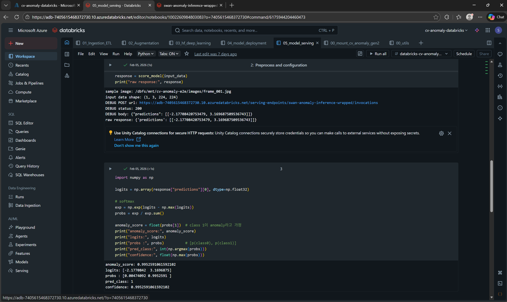
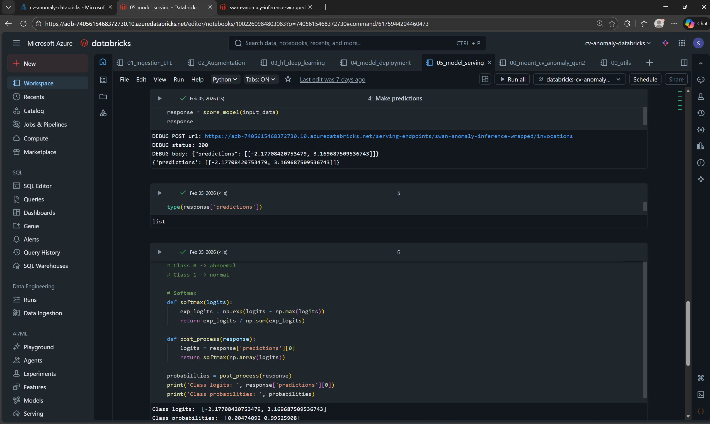

🦢 Cloud-Deployed ViT for Image Anomaly Scoring on Azure Databricks


End-to-end cloud-native computer vision pipeline for anomaly scoring using Vision Transformer (ViT), built and deployed on Azure Databricks with MLflow lifecycle management.

This project demonstrates full ML engineering capability:

- Local data generation
- Distributed Spark image processing
- MLflow experiment tracking
- Model registry versioning
- Managed model serving
- Production-style inference validation

---

# 📌 Problem Definition

Binary image classification used for anomaly scoring.

Class definition (strictly aligned with training code):

| Class | Meaning |
|-------|---------|
| 0     | Abnormal (synthetic anomaly) |
| 1     | Normal (swan frame) |

Anomaly score definition:

```

anomaly_score = P(class = 0 | image)

````

This score is derived from softmax(logits).

---

# 🏗 System Architecture

```mermaid
flowchart LR
    A[Raw Swan Video]
    B[Frame Extraction]
    C[Synthetic Anomaly Generation]
    D[Label Construction]
    E[Azure Data Lake]
    F[Databricks Mount]
    G[Spark ETL]
    H[Distributed Augmentation]
    I[ViT Fine-Tuning]
    J[MLflow Tracking]
    K[Model Registry]
    L[Databricks Model Serving]
    M[REST Invocation]
    N[Softmax]
    O[Anomaly Score]

    A --> B --> C --> D --> E
    E --> F --> G --> H --> I
    I --> J --> K --> L --> M --> N --> O
````

---

# 🧰 Tech Stack

| Category        | Tools                              |
| --------------- | ---------------------------------- |
| Language        | Python                             |
| Model           | google/vit-base-patch16-224        |
| Framework       | PyTorch + HuggingFace              |
| Data Processing | Apache Spark + pandas UDF          |
| Tracking        | MLflow                             |
| Cloud           | Azure Data Lake + Azure Databricks |
| Deployment      | Databricks Model Serving           |

---

# 📂 Repository Structure

```
cv-anomaly-detection-vit/
├── databricks_pipeline/
│   ├── 00_utils.py
│   ├── 01_Ingestion_ETL.py
│   ├── 02_Augmentation.py
│   ├── 03_hf_deep_learning.py
│   ├── 04_model_deployment.py
│   └── 05_model_serving.py
│
├── local_preprocessing/
│   ├── frames.py
│   ├── salt_pepper_noise.py
│   ├── label.py
│   └── llm.py
│
├── assets/
│   ├── 01_mlflow_experiments_overview.png
│   ├── 02_mlflow_experiments_artifacts.png
│   ├── 03_training_metrics.png
│   ├── 04_training_metrics.png
│   ├── 05_training_metrics.png
│   ├── 06_model_registry_version.png
│   ├── 07_serving_endpoint.png
│   ├── 08_serving_endpoint_wrapped.png
│   ├── 09_production_validation_results.png
│   └── 10_production_validation_results.png
│
└── README.md
```

---

# 🔹 Dataset Engineering

Synthetic anomaly strategy:

* Irregular polygon noise patches
* High-contrast salt and pepper artifacts
* Multi-region disturbance
* Controlled anomaly ratio

Purpose:

* Create clear structural deviation
* Validate softmax-based anomaly scoring
* Test deployment reliability

---

# 🔹 Distributed Image Processing (Spark)

Implemented:

* Image listing + label join
* Center-biased cropping
* Resize to model resolution
* Binary JPEG serialization
* Distributed augmentation with pandas UDF

This ensures reproducible dataset generation inside Azure.

---

# 🔹 Model Training (ViT + MLflow)

Model:

```
google/vit-base-patch16-224
```

Training setup:

* Binary classification
* Early stopping
* MLflow metric logging
* Confusion matrix evaluation
* Model artifact logging
* MLflow Model Registry versioning

---

# 📊 Training Evidence

### MLflow Experiments



### MLflow Artifacts



### Training Metrics





Observed:

* Stable convergence
* Clear separation between classes
* Consistent validation performance

---

# 🔹 Model Registry

Registered model version:


Demonstrates:

* Version-controlled deployment
* Artifact reproducibility
* Production-ready packaging

---

# 🔹 Deployment (Databricks Model Serving)

Endpoint created inside Azure Databricks.


Logits-only wrapped model to ensure serving schema stability.


REST Invocation Path:

```
/api/2.0/serving-endpoints/{endpoint-name}/invocations
```

---

# 🔹 Inference Logic

Endpoint returns:

```
{
  "predictions": [[logit_0, logit_1]]
}
```

Post-processing:

```
probs = softmax(logits)
anomaly_score = probs[0]
```

Example:

```
logits: [-2.17, 3.16]
probabilities: [0.0047, 0.9953]
predicted_class: 1 (normal)
anomaly_score: 0.0047
```

---

# 📊 Production Validation




Observed:

Normal samples:

* Low anomaly_score
* Stable softmax distribution

Abnormal samples:

* High anomaly_score
* Clear separation

Confirms deployment correctness and scoring stability.

---

# 🔐 Security

* No PAT tokens committed
* No SAS keys stored
* Secrets managed via environment variables or Databricks Secrets

---

# 🚀 Engineering Highlights

* Spark-based distributed image ETL
* pandas UDF vectorized transformations
* MLflow lifecycle tracking
* Versioned model registry
* Managed Azure serving
* REST inference validation
* Logits-only deployment-safe model wrapping
* Production-level anomaly scoring pipeline

---

# 👩‍💻 Author

Suhwa Seong
M.Sc. Data Science
University of Europe for Applied Sciences

Focus:

* Computer Vision
* ML Engineering
* MLOps
* Cloud-native ML Systems

```
---
