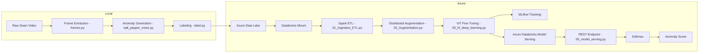

# 🦢 ViT-Based Image Anomaly Detection on Azure Databricks


End-to-end computer vision anomaly detection pipeline built using Azure Databricks and Vision Transformer (ViT).

This repository demonstrates a cloud-native ML workflow from raw video frame extraction to Azure-based model serving and anomaly scoring.

---

# 📌 Project Objective

The objective of this project was to design and implement a reproducible anomaly detection system with the following stages:

1. Extract frames from a single swan video
2. Generate synthetic anomaly samples
3. Construct a structured and balanced dataset
4. Fine-tune a Vision Transformer (ViT)
5. Track experiments using MLflow
6. Deploy and validate inference using Azure Databricks Model Serving

The focus extends beyond model accuracy to:

* Cloud-based data engineering
* Distributed image processing
* Secure credential management
* Model lifecycle management
* Deployment readiness in a managed cloud environment

---

# 🏗 System Architecture


---

# 🧰 Technology Stack

| Category            | Tools                                          |
| ------------------- | ---------------------------------------------- |
| Programming         | Python                                         |
| Deep Learning       | PyTorch, HuggingFace Transformers              |
| Model               | Vision Transformer (ViT)                       |
| Data Processing     | Apache Spark, pandas UDF                       |
| Cloud Storage       | Azure Data Lake                                |
| Cloud Compute       | Azure Databricks                               |
| Experiment Tracking | MLflow                                         |
| Deployment          | Azure Databricks Model Serving + REST Endpoint |

---

# 📂 Repository Structure

```
cv-anomaly-detection-vit/
│
├── databricks_pipeline/
│   ├── 00_utils.py
│   ├── 01_Ingestion_ETL.py
│   ├── 02_Augmentation.py
│   ├── 03_hf_deep_learning.py
│   ├── 04_model_deployment.py
│   └── 05_model_serving.py
│
├── local_preprocessing/
│   ├── frames.py
│   ├── label.py
│   ├── llm.py
│   └── salt_pepper_noise.py
│
├── .gitignore
└── README.md
```

---

# 🔹 Synthetic Anomaly Design Strategy

Unlike subtle noise injection, anomaly samples were intentionally designed to be visually distinguishable.

The synthetic anomalies:

* Use irregular polygon-shaped patches
* Introduce strong salt-and-pepper contrast
* Are clearly identifiable by human observation
* Create structural deviations from normal samples

The objective was not to simulate imperceptible perturbations, but to construct explicitly abnormal patterns to validate:

* Binary classification stability
* Clear decision boundary formation
* Softmax-based anomaly scoring reliability

This design ensures controlled learning behavior and stable deployment validation.

---

# 🔹 Local Preprocessing

## frames.py

Extracts individual frames from the raw video source.

## salt_pepper_noise.py

Implements irregular polygon-based anomaly synthesis with:

* Adjustable noise ratio
* Salt vs pepper contrast control
* Multi-patch random generation

## label.py

Creates structured labels for normal vs abnormal classes.

## llm.py

Optional experimental LLM-assisted labeling module.

---

# 🔹 Cloud Pipeline (Azure Databricks)

## 01_Ingestion_ETL.py

Spark-based ingestion pipeline:

* Load images from Azure Data Lake
* Join label metadata
* Crop and resize
* Convert to binary JPEG
* Save structured Parquet dataset

## 02_Augmentation.py

Distributed augmentation via pandas UDF:

* Flips
* Rotations
* Affine transforms
* Polygon-based synthetic anomalies

## 03_hf_deep_learning.py

Vision Transformer fine-tuning.

Model:

```
google/vit-base-patch16-224
```

Training:

* Input: 224 × 224 RGB
* Binary classification
* Early stopping
* MLflow tracking
* Model artifact logging

---

## 05_model_serving.py

Azure-based deployment validation:

* Invoke Azure Databricks Model Serving endpoint
* Receive raw logits
* Apply softmax transformation
* Compute anomaly score

Anomaly Score definition:

```
P(class = abnormal)
```

This confirms consistent model behavior under managed serving conditions.

---

# 📊 Results

### Model Configuration

* Architecture: Vision Transformer (ViT)
* Epochs: 5
* Learning rate: 2e-5
* Weight decay: 0.01
* Early stopping enabled

### Inference Behavior (Normal Samples)

* Average anomaly score ≈ 0.00024
* Maximum anomaly score < 0.01
* Stable probability distribution

The deployed model consistently assigns low anomaly probabilities to normal images, demonstrating stable inference behavior in Azure serving environment.

---

# 🔐 Security Considerations

* No Azure SAS tokens stored in repository
* No Databricks personal access tokens hardcoded
* Authentication handled via environment variables or Databricks Secrets

This repository follows secure credential management practices aligned with cloud deployment standards.

---

# 🚀 Deployment

The model is deployed using:

* MLflow model registration
* Azure Databricks Model Serving
* Managed REST endpoint invocation

No external API framework is used, as serving and inference are handled entirely within Azure Databricks environment.

---

# 💡 Engineering Highlights

* Distributed image processing with Spark
* Vectorized image transformation via pandas UDF
* MLflow experiment lifecycle tracking
* Azure-native model serving
* REST-based inference validation
* Secure cloud credential management

---

# 👩‍💻 Author

Suhwa Seong
M.Sc. Data Science
University of Europe for Applied Sciences

Focus areas:

* Computer Vision
* ML Engineering
* Cloud-based ML Systems
* Deployment & MLOps

---

# 🎯 Purpose of This Repository

This project demonstrates:

* End-to-end ML engineering capability
* Cloud-based data processing
* Experiment tracking and model lifecycle management
* Managed cloud deployment experience
* Secure and reproducible ML workflow design

---
