```mermaid
flowchart LR

    subgraph Local
        A[Raw Swan Video]
        B[Frame Extraction - frames.py]
        C[Explicit Synthetic Anomaly Generation - salt_pepper_noise.py]
        D[Labeling - label.py]
    end

    subgraph Azure
        E[Azure Data Lake]
        F[Databricks Mount]
        G[Spark ETL - 01_Ingestion_ETL.py]
        H[Distributed Augmentation - 02_Augmentation.py]
        I[ViT Fine-Tuning - 03_hf_deep_learning.py]
        J[MLflow Tracking]
        K[Model Registry]
        L[Azure Databricks Model Serving]
        M[REST Endpoint Invocation - 05_model_serving.py]
        N[Softmax]
        O[Anomaly Score]
    end

    A --> B --> C --> D --> E
    E --> F --> G --> H --> I
    I --> J --> K --> L --> M --> N --> O
```

# 🦢 Cloud-Deployed Vision Transformer for Image Anomaly Detection on Azure Databricks


End-to-end computer vision anomaly detection pipeline built using **Azure Databricks** and **Vision Transformer (ViT)**.

This repository demonstrates a cloud-native machine learning workflow from raw video frame extraction to **managed Azure model serving and production-level anomaly scoring**.

---

# 📌 Project Objective

The objective of this project was to design and implement a reproducible anomaly detection system with the following stages:

1. Extract frames from a single swan video
2. Generate clearly distinguishable synthetic anomaly samples
3. Construct a structured and balanced dataset
4. Fine-tune a Vision Transformer (ViT)
5. Track experiments using MLflow
6. Deploy and validate inference using Azure Databricks Model Serving

The focus extends beyond model accuracy to:

* Cloud-based data engineering
* Distributed image processing with Spark
* Secure credential management
* Model lifecycle management
* Deployment validation in a managed Azure environment

---

# 🏗 System Architecture



---

# 🧰 Technology Stack

| Category            | Tools                             |
| ------------------- | --------------------------------- |
| Programming         | Python                            |
| Deep Learning       | PyTorch, HuggingFace Transformers |
| Model               | Vision Transformer (ViT)          |
| Data Processing     | Apache Spark, pandas UDF          |
| Cloud Storage       | Azure Data Lake                   |
| Cloud Compute       | Azure Databricks                  |
| Experiment Tracking | MLflow                            |
| Deployment          | Azure Databricks Model Serving    |

---

# 📂 Repository Structure

```
cv-anomaly-detection-vit/
│
├── databricks_pipeline/
│   ├── 00_utils.py
│   ├── 01_Ingestion_ETL.py
│   ├── 02_Augmentation.py
│   ├── 03_hf_deep_learning.py
│   ├── 04_model_deployment.py
│   └── 05_model_serving.py
│
├── local_preprocessing/
│   ├── frames.py
│   ├── label.py
│   ├── llm.py
│   └── salt_pepper_noise.py
│
├── .gitignore
└── README.md
```

---

# 🔹 Synthetic Anomaly Design Strategy

Unlike subtle perturbation-based anomaly simulation, anomaly samples in this project were intentionally designed to be **visually explicit and structurally abnormal**.

The synthetic anomalies:

* Use irregular polygon-shaped patches
* Introduce strong salt-and-pepper contrast
* Are clearly distinguishable by human inspection
* Create significant structural deviation from normal frames

The purpose was not to simulate imperceptible noise, but to:

* Establish a clear binary decision boundary
* Validate classification stability
* Ensure softmax-based anomaly scoring behaves reliably
* Create controlled learning behavior for deployment testing

This approach supports stable production validation under managed serving.

---

# 🔹 Local Preprocessing

## frames.py

Extracts individual image frames from the raw swan video.

## salt_pepper_noise.py

Implements explicit anomaly synthesis with:

* Adjustable noise ratio
* Salt vs pepper contrast control
* Irregular polygon masking
* Multi-patch random generation

## label.py

Generates structured labels for normal vs abnormal classes.

## llm.py

Optional experimental LLM-assisted metadata or labeling support.

---

# 🔹 Cloud Pipeline (Azure Databricks)

## 01_Ingestion_ETL.py

Spark-based ingestion pipeline:

* Load images from Azure Data Lake
* Join with label metadata
* Crop and resize
* Convert to binary JPEG
* Save structured Parquet dataset

Ensures reproducible dataset construction.

---

## 02_Augmentation.py

Distributed augmentation using pandas UDF:

* Horizontal / vertical flips
* Rotations
* Affine transformations
* Additional polygon-based anomaly generation

Enables scalable dataset balancing.

---

## 03_hf_deep_learning.py

Vision Transformer fine-tuning.

Model:

```
google/vit-base-patch16-224
```

Training setup:

* Input shape: 224 × 224 RGB
* Binary classification
* Early stopping
* MLflow experiment tracking
* Model artifact logging
* Model registration in MLflow Registry

---

## 05_model_serving.py

Deployment validation logic:

* Invoke Azure Databricks Model Serving endpoint
* Receive raw logits
* Apply softmax transformation
* Compute anomaly probability

Anomaly Score definition:

```
Anomaly Score = P(class = abnormal)
```

No external API framework is used. All serving is handled inside Azure Databricks.

---

# 📊 Production Validation Results

The trained model was deployed via **Azure Databricks Model Serving** and validated through live REST endpoint invocation.

### Example Endpoint Output

```
logits: [-2.1770842, 3.1696875]
probabilities: [0.0047, 0.9953]
predicted_class: 1
confidence: 0.9953
```

### Observed Behavior

**Normal samples**

* Low anomaly probabilities
* Stable softmax distributions
* High confidence

**Synthetic anomaly samples**

* High anomaly probability
* Clear separation from normal class
* Stable endpoint behavior

The serving endpoint returned consistent predictions with correct tensor schema handling, confirming production-level inference reliability.

---

# 🔐 Security Considerations

* No Azure SAS tokens stored in repository
* No Databricks personal access tokens hardcoded
* Credentials managed via environment variables or Databricks Secrets

This project follows secure cloud deployment practices.

---

# 🚀 Deployment

The model is deployed using:

* MLflow Model Registration
* Azure Databricks Model Serving
* Managed REST endpoint invocation

Serving and inference are fully managed within Azure Databricks.

---

# 💡 Engineering Highlights

* Distributed image processing using Spark
* Vectorized image transformations via pandas UDF
* MLflow-based experiment lifecycle tracking
* Managed Azure model serving
* REST-based inference validation
* Secure credential management
* Explicit anomaly design for boundary validation

---

# 👩‍💻 Author

Suhwa Seong
M.Sc. Data Science
University of Europe for Applied Sciences

Focus areas:

* Computer Vision
* ML Engineering
* Cloud-based ML Systems
* Model Deployment & MLOps

---

# 🎯 Purpose of This Repository

This project demonstrates:

* End-to-end ML engineering capability
* Cloud-native data processing
* Experiment tracking and model lifecycle management
* Managed Azure model deployment experience
* Secure and reproducible ML workflow design
* Production-level inference validation

---
